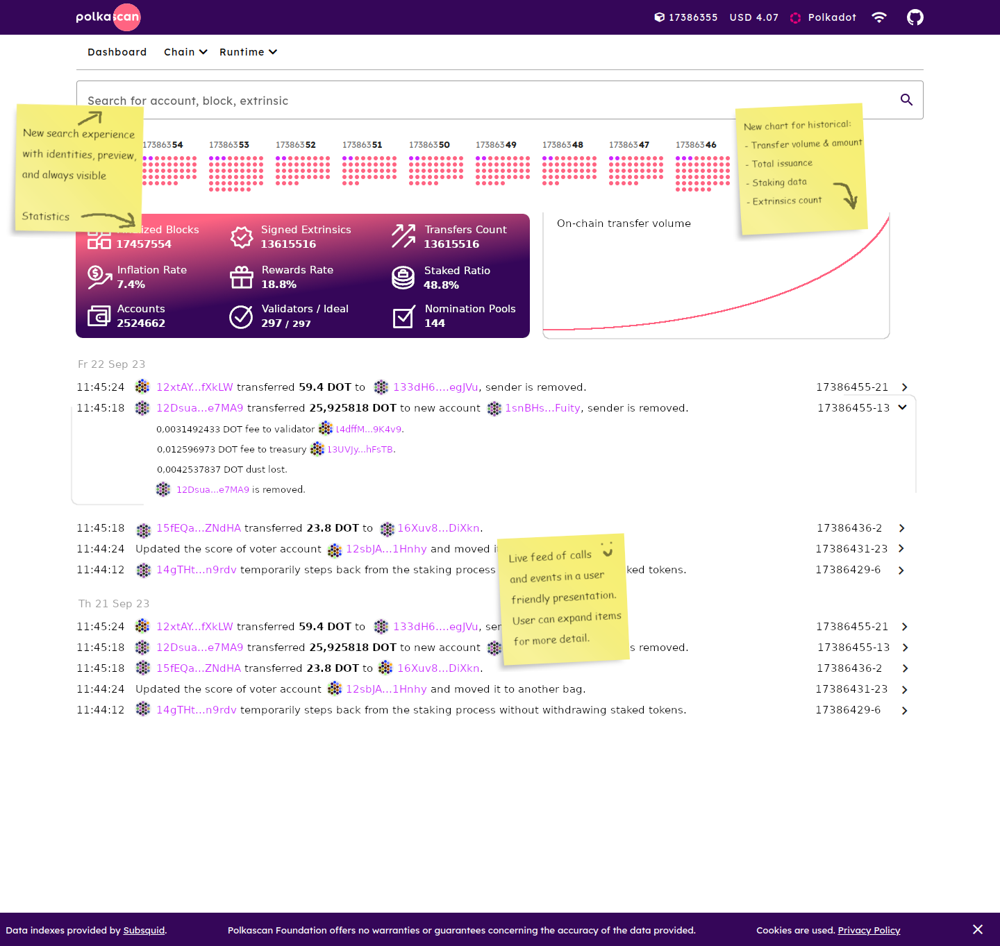

# Beyond Raw Data: How Polkascan Transforms Subsquid Aggregates into a User-Friendly Polkadot Experience (Polkadot Referendum)

## Introduction

> Now, we aim to enhance the Polkascan Explorer by tapping into the rich data resource Subsquid offers, making the tool more powerful and user-friendly.

With the support we received from the Kusama community in a past voting event (#83), we've built an extension for our open source block explorer that allows us to connect with Subsquid, a service that makes data available from the Polkadot network that is not easy to query from a node.

We incorporated Subsquid's data into the Polkascan Explorer, which is an open source block explorer to track the activity happening on the Polkadot network, as well as other Substrate-based networks. Our software is open-source, meaning it's freely available for anyone to use, modify, and distribute. This is particularly beneficial for parachain teams looking to host and customize their own blockchain explorers. They can use our software as a foundational tool to build an explorer that caters specifically to their community's needs.

Now, these teams can choose where they get their data from: they can use data from existing API's hosted by Subsquid, use data they index themselves with the Polkascan API on their own machines, or use a combination of both for extra reliability.

Until now, we put in a lot of work to ensure that Subsquid's data could be used seamlessly with the existing features of our Polkascan Explorer. Meaning, no matter where you decide to get your data from, you'll have the same user experience.

But there is an opportunity - Subsquid has even more data available and plans to add even more valuable information in the future, including details about transfers made with Polkadot's cross-chain messaging service.

So, what we want to do now with this proposal is to take full advantage of all this extra data that Subsquid offers. We want to improve the Polkascan Explorer by making all of Subsquid's extensive data available through it, ultimately aiming to make the explorer a more powerful and user-friendly tool for every Substrate-based network.

Here's what we have planned:

## Dashboard Enhancement

> We want our dashboard to offer more than just a glimpse of the latest blocks and activities. We plan to add easy-to-understand descriptions and insights, like token distribution and inflation rates, enhancing the experience for both novice and advanced users.

At the moment, our dashboard page merely shows an animation of the incoming blocks and the number of extrinsics and events. We would like to enhance the dashboard experience by expanding it with more useful statistical information, e.g. issued tokens, token distribution, staking averages, inflation, etc.

Also, we would like to add a live list of incoming calls and events on this page, but we would like to do things a bit different from other block explorers. Polkascan Foundation's mission is to make Polkadot accessible & understandable. So instead of showing raw technical information (pallets, technical names, attribute, etc.), we want to show descriptive understandable one-liners of each call and event, and their properties. Power users will be able to toggle between this 'user-friendly' mode and the 'technical' mode.

A sketch of what this dashboard could look like:

## Validators and Staking Page

> Find validators with ease on our new page that showcases all network validators, equipped with search and filter options.

We would like to introduce a new page that shows all active validators of the network, with some search and filtering functionality that helps you find the validator you're looking for.

## Calls Page

> To give you a deeper understanding of network activities, we're adding a Calls page that lists individual calls, unavailable elsewhere, enhancing your data analysis capabilities.

Polkascan currently has a page with a list of extrinsics and a page with events. We would like to add a list page for calls, a feature only available when Subsquid data is used. While the extrinsics page and calls page will look similar, the difference is that an extrinsic can have multiple calls, so you don't get to see the individual calls on the extrinsics list, while these calls will be shown on the new calls page.

## Making List Pages Understandable

> We aim to declutter list pages by highlighting the most relevant info while giving power users the option to dive into technical details if they wish.

On the list pages of various items, a lot of information is very technical. We would like to display one line understandable descriptions for every item, like we want to do on the dashboard page. A toggle lets the user switch between 'friendly' and 'technical' mode. 

Some items are also not very interesting to the user, because they contain merely system triggered, low level information. These items don't really add value for most users. We would like to make the list pages more user friendly by filtering them for the common user. Advanced users will get the option to view each and every item.

## More Identity Features

> Discover accounts using on-chain registered identities, a feature bolstered by data from Subsquid.

Thanks to data provided by Subsquid, we can now expand the search functionality with account identities, so you can find an account by it's on-chain registered identity.

Polkascan fetches identities from the substrate node. These identities are now also available in the Giant Squid. We would like to use these Gaint Squid identities as a fallback when the substrate node can not present an identity. Possibly we can use the Giant Squid as an historical node if an identity or account has been removed on-chain. 

## Search Bar Improvements

> Enjoy a seamless search experience with a constantly available search bar that offers previews of your search results.

We want to further improve the search experience. The search bar should always be available, instead of showing it only on the dashboard as it is now. While typing, the search bar will show a preview with results for the user's search query.

## Transfers and Rewards Pages

> We're improving our pages to leverage Subsquid's specialized data lists for transfers and rewards, promising speed and efficiency.

We already have a page for transfers, but it could load a lot faster. Currently it uses a list of events that is filtered by any event type that has to do with transfers from one account to another. This works, but is suboptimal, because Subsquid has created a dedicated data list of these transfers that is also faster to query. This feature is missing from our own Polkscan backend API, so the filtered event way of getting the transfers will still serve as a fallback mechanism. But for clients that use Subsquid, we will introduce new code to use their dedicated transfers list. From the user's perspective, loading time will be improved.

The same goes for staking rewards. Subsquid also has a dedicated list of rewards for us to use instead of filtering events, like we do now. For rewards, we'll now have the capability to create new list page with all recent staking rewards for any account.

## Combine Staking Events with Staking Calls

> We're merging staking events and calls into one comprehensive view, giving you a complete picture of staking activities at a glance.

Currently, the Staking tab within the account page predominantly displays staking-related events. While this feature has been useful, we recognize that it can be further improved to offer a more comprehensive view of staking activities, providing users with a fuller picture of the staking landscape. We want to augment the existing functionality by incorporating staking calls alongside staking events and provide a cohesive presentation. Users will have access to a complete set of staking data, painting a full picture of all staking activities without having to toggle between different resources.

## Historical Balance

> Track account balance changes effortlessly with our revamped chart that offers a broader perspective by showcasing daily or weekly data points.

The historical balance chart currently plots a data point for every change of an account balance, based on event data. Some accounts have lots of these changes per day, rendering the chart unusable. We want to fix this by querying balances in daily and/or weekly intervals. The chart will then be able to present a usable chart for larger periods of time.

## Technical improvements

> Behind the scenes, we're fine-tuning our system to enhance data presentation and ensure smooth operation amidst changes in Subsquid's service architecture, including adapting to handle big numbers more effectively.

### Improve Presentation of Event Attributes and Call Arguments

Event attributes and call arguments fetched from the giant squid must be parsed with metadata from the substrate node to identify data types. (If availabe in the substrate node, these attributes and arguments get priority.)

### Deprecation of Certain Subsquid Endpoints

Our explorer uses multiple Subsquid endpoints for different parts of data. Subsquid has given us a heads up about deprecation of some of these endpoints. We need to migrate away from these and only utilize the GiantSquid endpoints. Data handling in our Subsquid adapter needs to be revised.

### BN.js for Big Numbers

We want to start using BN.js in our adapters and in the explorer. This fixes tokens that have 12 or more decimal values.

## Overview of time planned

| Category                                                    | Hours |
|:----------------------------------------------------------- | -----:|
| Dashboard Enhancement                                       |    64 |
| Validators Page                                             |    32 |
| Calls Page                                                  |    32 |
| Making List Pages Understandable                            |    64 |
| More Identity Features                                      |    32 |
| Search Bar Improvements                                     |    24 |
| Transfers and Rewards Pages                                 |    32 |
| Combine Staking Events with Staking Calls                   |    32 |
| Historical Balance                                          |    48 |
| Improve Presentation of Event Attributes and Call Arguments |    32 |
| Deprecation of Certain Subsquid Endpoints                   |    16 |
| BN.js for Big Numbers                                       |    24 |
|                                                             |       |
| Hours total                                                 |   432 |

## Team & Planning

The team will consist of two part-time developers. We estimate a duration of 15 weeks of development work.

## Reporting

Polkascan Foundation will report and evaluate after delivery in Polkassembly and other relevant channels.

## Treasury Spending Proposal

|                            |           Amount |
|:-------------------------- | ----------------:|
| Hours total                |              432 |
| Hourly rate                |     € 151.25[^1] |
| Services                   |       65,340 EUR |
| Treasury Spending Proposal |    16955 DOT[^2] |

Polkascan verified beneficiary account: [13eDnpY969xLyu7NgnV9bVg5s9dcrq1UyQn7wAuDXxtYyKA6](https://explorer.polkascan.io/polkadot/account/13eDnpY969xLyu7NgnV9bVg5s9dcrq1UyQn7wAuDXxtYyKA6)

## About Polkascan

[Polkascan Foundation](https://polkascan.org/) is a not-for-profit infrastructure service provider and maintainer of open source software, such as [Polkascan Explorer](https://explorer.polkascan.io/), [Python libraries](https://github.com/polkascan/social-contract/blob/master/polkadot/social-contract-002.md), and new and upcoming tools such as [Polkascan Calendar](https://calendar.polkascan.io).

[^1]: Please refer to our [Business Plan](https://polkascan.org/wp-content/uploads/2022/03/Business-Plan-Polkascan-Foundation-v20220218.1030.pdf) (page 39) for the composition of our hourly rate.

[^2]: The amount of DOT to cover the expenses will be liquidated in advance from our DOT reserves to prevent foreign exchange risk. For this reason, the price snapshot will be taken on the day of the publication of this Treasury Proposal. [Kraken](https://trade.kraken.com/charts/KRAKEN:DOT-EUR) lists the following spot price on October 5th 2023, 13:15 CET: 3.8538 EUR/DOT.
